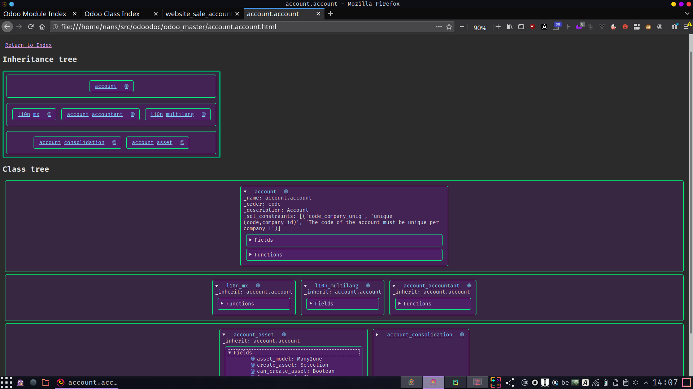

# OdooDoc

Tl;dr: rarefied Doxygen for Odoo.

Automatically generates documentation for Odoo models.
Give an index (`index.*.html`) to the inheritance tree of all Odoo classes and all Odoo modules.

Everything is static for now.
The folder also contains all the information in `.py` files that are dicts
(essentially json) that can be eval'd to be able to easily query any model.

See TODO section: this is more of a stub than a project.

## Usage
Simply execute the script. Requirements are listed in the imports. Python 3.5+ 

Generates the documentation for a set of addons path.
Each repository should already be in the desired version.
For example, if you want to check the models for a development branch dev-branch,
built against the enterprise branch 13.0,
then the Odoo folder should be on branch dev-branch and enterprise on 13.0.

The branches should be clean, i.e. up-to-date against the online version,
so that online links work. Otherwise line numbers, or even file paths will be wrong.
Unexpected things might cause arbitrary crashes, so stay clean.*

Arguments:
 - `output_path, -o`: folder for the documentation (defaults to `odoo_'branch_name(s)'`)
 - `web_root, -w`: online root for links (defaults to `https://github.com/odoo/`)
 - `paths, -p`: paths for the Odoo addons (defaults to `~/src/odoo,~/src/enterprise`)

*this script has been tested on all supported stable versions of Odoo.
Some special cases have been added on a case by case basis depending on the codebase.
An example is that there is one class which _name is not an instance of str;
this needed two lines of code to tolerate that deviancy.
Weird things in custom code might thus kill the script. PR/forks welcome!

## TODO:
This parser is the first building block in having code assistance for Odoo.
It's born from the observation that within Odoo itself, the only tool that is used is grep.
As a result, sometimes a non-existing field is called, 
or it is called from a module which does not depend on the module defining it, etc.
And with function or fields with a generic name, it's a pain to work. 
Code is not mere text, it's structured data.
The next steps would be:
 - dynamic React frontend search (with a lightweight server)
 - support for giving a list of installed modules
 - style type of fields (colours, ...) etc. (for constraints? they are unreadable)
 - parse more information (decorators, args, ...)
 - get ending lineno  => embed source code => get full code with inheritance for a given function
   (should then store this information in a database, as it would be huge)
 - IDE integration
 - ...

I won't work on any of that in the near future since there is no motivation
from Odoo to build any of that. 
It can already be useful in it's current state,
and if anybody is interested in working on it feel free to drop me a line.

## Comments

One goal was to keep things as minimal as possible,
however the resulting code is spartan.
Typing was introduced as a way to simplify reasoning about the code,
however this specific project seems to go against each of its limits
(support for lxml, basic algebraic data types). So it goes.
